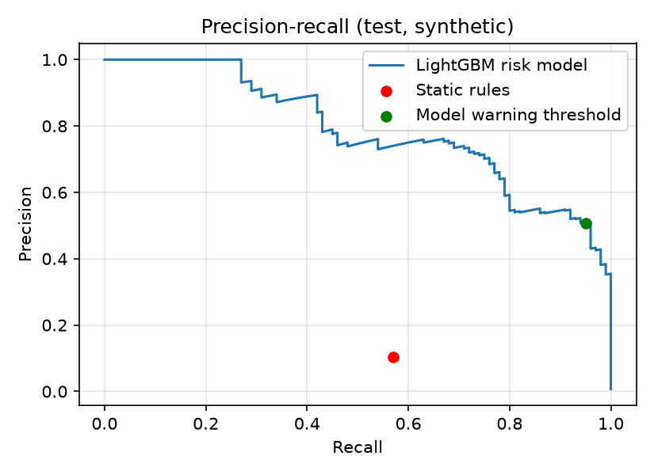
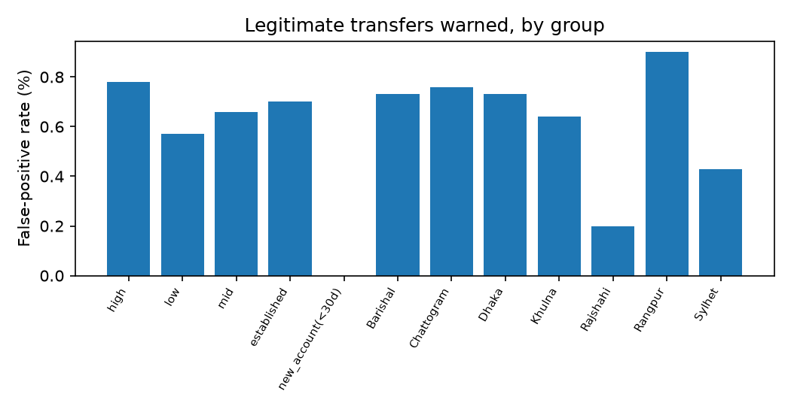
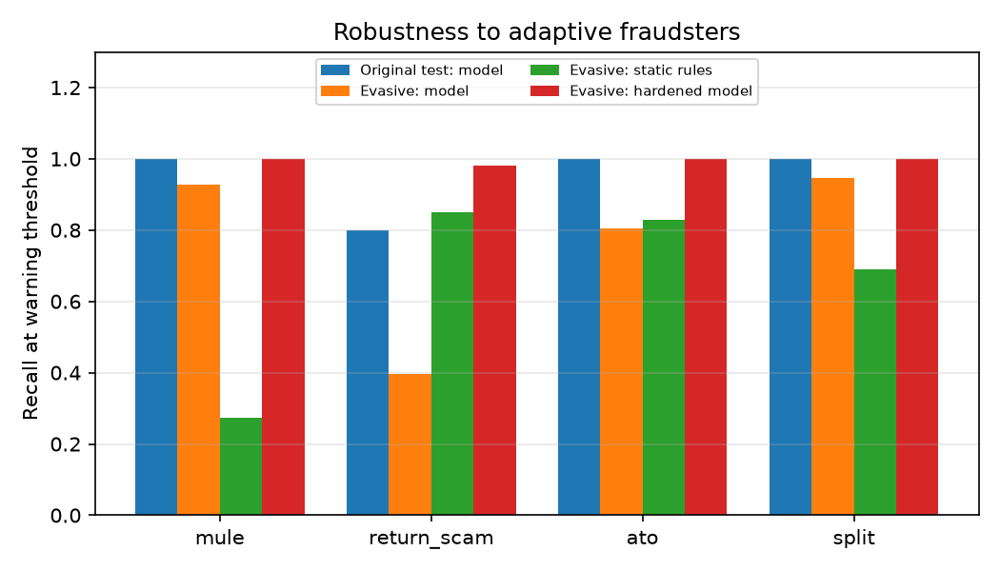

# Safe-Send: Evaluation Report

All results use **synthetic data**. They show that the method works and how it behaves; they do not predict real-world accuracy. Test periods are chronological and were never used for training or threshold selection.

## 1. Model vs static rules (original test set)

Test set: 14,018 transfers, 100 scams (0.7%).

| Metric | Static rules | Risk model |
|---|---|---|
| Alert volume | 4.0% | 1.3% (warning threshold) |
| Recall | 57.0% | 95.0% (95% CI 88.8-97.9%) |
| False-positive rate | 3.6% | 0.7% (95% CI 0.5-0.8%) |
| Precision | 10.3% | 50.8% |
| Recall at the SAME alert volume as the rules | 57.0% | 100.0% |
| PR-AUC | n/a | 0.7878 |

The model catches more scams than the rules while warning far fewer legitimate senders.

## 2. Recall by scam pattern (95% confidence intervals)

| Pattern | n | Rules | Model | Model 95% CI |
|---|---|---|---|---|
| mule | 45 | 24.4% | 100.0% | 92.1-100.0% |
| return_scam | 25 | 68.0% | 80.0% | 60.9-91.1% |
| ato | 11 | 90.9% | 100.0% | 74.1-100.0% |
| split | 19 | 100.0% | 100.0% | 83.2-100.0% |

Small counts give wide intervals. Treat single-pattern numbers as indicative.

## 3. Fairness checks

False-positive rate = share of legitimate transfers that receive a warning. Large gaps between groups would need investigation before any real deployment.

**Sender value band** (highest/lowest FPR ratio: 1.37x)

| Group | Legit transfers | FPR | 95% CI | Scams | Recall |
|---|---|---|---|---|---|
| high | 1,799 | 0.8% | 0.5-1.3% | 11 | 81.8% |
| low | 2,632 | 0.6% | 0.4-0.9% | 22 | 100.0% |
| mid | 9,487 | 0.7% | 0.5-0.9% | 67 | 95.5% |

**Sender account age**

| Group | Legit transfers | FPR | 95% CI | Scams | Recall |
|---|---|---|---|---|---|
| established | 13,119 | 0.7% | 0.6-0.9% | 100 | 95.0% |
| new_account(<30d) | 799 | 0.0% | 0.0-0.5% | 0 | n/a |

**Region** (highest/lowest FPR ratio: 4.5x)

| Group | Legit transfers | FPR | 95% CI | Scams | Recall |
|---|---|---|---|---|---|
| Barishal | 960 | 0.7% | 0.4-1.5% | 3 | 100.0% |
| Chattogram | 2,234 | 0.8% | 0.5-1.2% | 8 | 87.5% |
| Dhaka | 5,316 | 0.7% | 0.5-1.0% | 41 | 92.7% |
| Khulna | 1,402 | 0.6% | 0.3-1.2% | 7 | 100.0% |
| Rajshahi | 1,499 | 0.2% | 0.1-0.6% | 13 | 92.3% |
| Rangpur | 1,340 | 0.9% | 0.5-1.6% | 13 | 100.0% |
| Sylhet | 1,167 | 0.4% | 0.2-1.0% | 15 | 100.0% |

Note: the region FPR ratio is driven by small groups; their confidence intervals overlap, so no region is shown to be treated differently.

Limitation: the synthetic data has no protected attributes beyond region and value band. A real audit would use real demographic and access-related groups.

## 4. Evasion stress test (adaptive fraudsters)

A second synthetic world where fraudsters adapt: mule rings rotate accounts (about 4 victims per mule) and collect slowly, splitting uses 800-2,400 Tk pieces spread over hours, takeovers use modest amounts from the victim's own device, and return scams are always partial and go to older accounts.

Evasive test set: 14,604 transfers, 674 scams. The original model and thresholds are used unchanged.

| Pattern | n | Rules | Original model | Hardened model* |
|---|---|---|---|---|
| mule | 246 | 27.2% | 92.7% | 100.0% |
| return_scam | 53 | 84.9% | 39.6% | 98.1% |
| ato | 41 | 82.9% | 80.5% | 100.0% |
| split | 334 | 68.9% | 94.6% | 100.0% |

Overall on evasive data: original model recall 88.7% at FPR 0.5%; static rules recall 55.8%; hardened model recall 99.9% at FPR 0.7%.

*Hardened = retrained on the original training data plus the evasive training period (days before 40), tested on the evasive test period. On the original test set the hardened model scores recall 100.0% at FPR 0.8%, so hardening does not break the original behaviour.

Takeaway: adaptive fraudsters reduce detection (the largest drop is on partial return scams), as expected in any fraud system. Retraining with confirmed cases (the investigator feedback loop in the architecture) restores it. Caveat: the hardened model is tested on the SAME evasion strategy it was trained on, so its near-perfect recall is optimistic. A real adversary would adapt again, so this is an ongoing process, not a one-time fix.

## 5. Simulated warning effect and estimated loss prevented

**This section is a simulation based on stated assumptions, not measured user behaviour.** Assumed probability that the sender abandons the transfer after the response:

| Tier | Scam transfer | Legitimate transfer |
|---|---|---|
| low | 0.0% | 0.0% |
| medium | 25.0% | 3.0% |
| high | 50.0% | 10.0% |
| extreme | 95.0% | 10.0% |

Extreme tier means a hold reviewed by a person (assumed 95% correct on real scams).

| Scenario | Scam loss prevented | Legit transfers warned | Legit transfers abandoned | Legit value abandoned |
|---|---|---|---|---|
| Senders follow assumed behaviour | 47.5% (155,131 of 326,680 Tk) | 0.66% | 0.03% | 6,838 Tk |
| Weaker warning effect (half) | 23.7% (77,566 of 326,680 Tk) | 0.66% | 0.01% | 3,419 Tk |
| Stronger warning effect (1.5x) | 62.4% (203,954 of 326,680 Tk) | 0.66% | 0.04% | 10,257 Tk |
| Senders ignore warnings, only holds work | 19.7% (64,248 of 326,680 Tk) | 0.66% | 0.00% | 0 Tk |

Even if senders ignored every warning, human review of extreme cases would still prevent part of the loss. The real effect of warnings must be measured with a controlled experiment (see Scale plan).

## 6. Investigator workload

On the test set (14,018 transfers): 13 cases per 10,000 transfers reach the investigator queue (extreme tier). 100.0% of them are real scams. Medium and high tiers are handled by the sender warning without investigator effort.

## 7. Latency

Measured with `python scripts/benchmark_latency.py`: p95 of about 4 ms per scoring request on a laptop, against a 200 ms target.

## 8. What the model relies on

Share of total split gain per feature (top 8). Gain shows where the trees split most, not the effect on each individual decision.

| Feature | Share of gain |
|---|---|
| recipient_age_h | 86.7% |
| recipient_out_count_prior | 2.8% |
| amount_to_mean_ratio | 1.8% |
| sender_received_3h | 1.6% |
| recipient_cashout_prior | 1.3% |
| returning_recent_received | 1.0% |
| recipient_in_out_ratio | 0.9% |
| amount | 0.7% |

The model leans heavily on recipient account age. This reflects how the synthetic data was built: most scam recipients are young accounts, with about 30% of mule accounts aged to make the task harder, and legitimate look-alikes with young recipients as counter-examples. Real data may differ, so this dependence must be checked during controlled validation.

## 9. Known limitations

- Synthetic data: results show method validity, not real-world performance.
- Per-pattern and per-group counts are small, so confidence intervals are wide.
- Warning-effect numbers rely on assumptions; they are illustrative.
- The evasive world is one adaptation strategy among many; hardened results are in-distribution and optimistic.
- Some reasons describe the recipient, which the sender cannot verify; the system treats this as evidence, not as proof.
- Features such as device sharing and fan-in need real telemetry before deployment.
