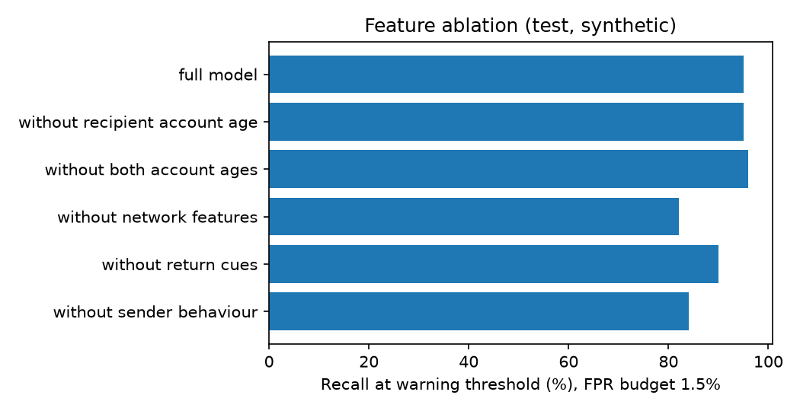
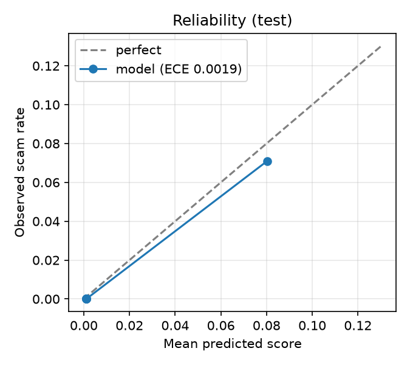

# Model Evidence Pack

Synthetic data, chronological split, test set with 100 scams (wide intervals). Each variant is retrained and its warning threshold is re-chosen on validation (false-positive budget 1.5%).

## 1. Feature ablation: does the model depend on one shortcut?

| Variant | Features | Recall | False-positive rate | Precision | PR-AUC |
|---|---|---|---|---|---|
| full model | 32 | 95.0% | 0.7% | 50.8% | 0.7878 |
| without recipient account age | 31 | 95.0% | 0.6% | 51.6% | 0.8459 |
| without both account ages | 30 | 96.0% | 0.7% | 51.1% | 0.7957 |
| without network features | 24 | 82.0% | 0.7% | 46.3% | 0.7676 |
| without return cues | 29 | 90.0% | 0.6% | 51.4% | 0.7617 |
| without sender behaviour | 23 | 84.0% | 0.6% | 50.6% | 0.7681 |

Reading: a large drop without recipient account age shows reliance on that feature. The remaining groups show how much the network and return cues add on their own.

## 2. Calibration

Expected calibration error on test: **0.0019** (raw), **0.0018** after isotonic calibration fitted on validation.

| Bin | n | Mean score | Observed scam rate |
|---|---|---|---|
| 1 | 606 | 0.001 | 0.0 |
| 5 | 5998 | 0.001 | 0.0 |
| 6 | 1757 | 0.001 | 0.0 |
| 7 | 1443 | 0.001 | 0.0 |
| 8 | 1379 | 0.001 | 0.0 |
| 9 | 1427 | 0.0011 | 0.0 |
| 10 | 1408 | 0.0803 | 0.071 |

Scores are used as rankings with false-positive-budget thresholds, so tiers do not depend on calibration. Calibrate before showing probabilities to users.

## 3. Cost-based threshold vs false-positive budget

Assumptions: average loss 4900 Tk, 45% of warned scam value prevented, 20 Tk per needless warning.

| Threshold rule | Recall | False-positive rate | Precision | Expected cost on test (Tk) |
|---|---|---|---|---|
| False-positive budget (deployed) | 95.0% | 0.7% | 50.8% | 282,365 |
| Cost-optimal on validation | 95.0% | 0.7% | 50.8% | 282,365 |

The cost-optimal threshold differs from the deployed one; compare the two rows.
Cost with no warnings at all: 490,000 Tk.

## 4. Simple baseline: logistic regression

| Model | Recall | False-positive rate | Precision | PR-AUC |
|---|---|---|---|---|
| Logistic regression | 90.0% | 0.8% | 46.4% | 0.7976 |
| LightGBM (deployed) | 95.0% | 0.7% | 50.8% | 0.7878 |

## Limits

- Synthetic data and a small test set: differences of a few points are not significant.
- Cost assumptions are illustrative and must be replaced with real loss and friction figures.
